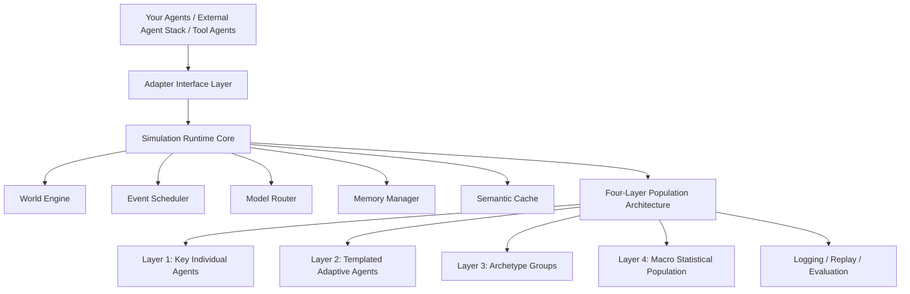
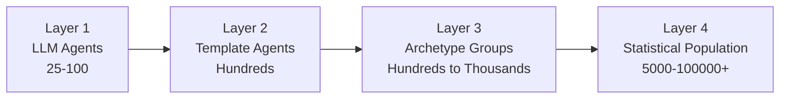
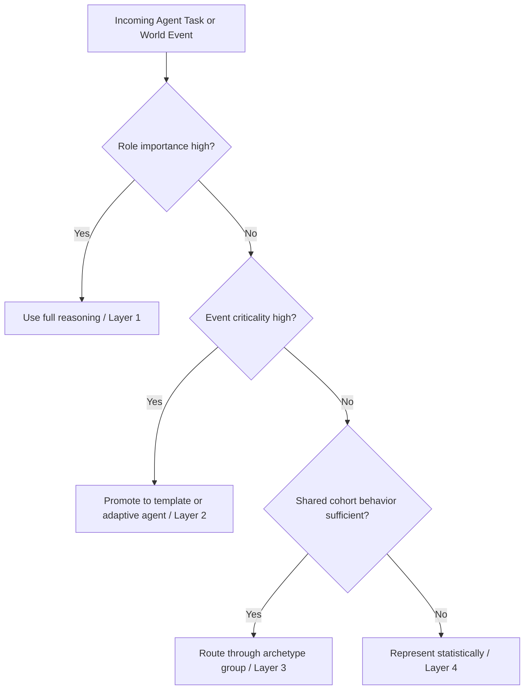

<div align="center">

# Universal Multi-Agent Simulation Engine

[English](README.md) | [繁體中文](README.zh-TW.md)

**A scalable architecture for large-scale simulations that allocates intelligence selectively instead of forcing every entity through the same cognition stack.**


</div>

---

## Overview

Universal Multi-Agent Simulation Engine is an open architecture for teams that want to build synthetic societies, economic systems, game worlds, and policy simulations without paying full reasoning cost for every entity.

Its core thesis is simple: simulation quality depends less on maximizing intelligence everywhere, and more on allocating intelligence where it changes the outcome.

That means critical agents can run deep reasoning, recurring roles can use templates, representative groups can diffuse from archetypes, and the long tail can remain statistical without breaking the coherence of the world.

---

## What makes this different

- Not every entity needs the same cognition stack.
- Fidelity should be allocated, not assumed.
- Scale should degrade gracefully, not collapse expensively.
- Domain knowledge should live in world configuration, not be hardcoded into agent logic.
- The runtime should integrate with your existing agents instead of forcing a closed framework rewrite.

---

## Architecture Snapshot

### Public Architecture Diagram


`assets/architecture-overview-v2.png` is the main public-facing diagram for the repository. It should present the full stack from external agents and adapters down to runtime orchestration and the four-layer population model.

For a more detailed systems view, see `assets/architecture-detail-v2.png`.

### Reference Runtime Flow



### Demo and Screenshots


<p align="center">
  
  
  
</p>

Use the `assets/` directory for polished public visuals. The current repository includes placeholders so the structure is ready for diagrams, GIFs, and screenshots.

---

## Three design principles

### 1. Behavior and domain should be separated
The agent loop itself is general: perceive, reason, act, and update memory. Domain-specific rules belong in world configuration, scenario policies, and environment constraints instead of being hardcoded into the cognitive core.

### 2. Cost and quality should be tunable
The same conceptual agent can operate at multiple fidelity levels depending on role importance, event criticality, expected downstream impact, and budget.

In practice, the runtime can shift between:
- full LLM agents
- template-driven agents
- archetype-based diffusion
- statistical approximations

### 3. Scale should be adaptive
A simulation with 25 agents and a simulation with 100,000 agents should not require different architectural ideas. The engine should choose the appropriate execution strategy automatically rather than forcing a single expensive path.

---

## Four-layer population model

| Layer | Mode | Typical scale | Use when |
|---|---|---:|---|
| 1 | LLM agents | 25-100 | key individuals, leadership roles, rare critical decisions |
| 2 | Template agents | hundreds | recurring roles that need consistency but not deep reasoning every step |
| 3 | Archetype groups | hundreds to thousands | representative cohorts with shared behavior patterns |
| 4 | Statistical population | 5,000-100,000+ | background population, aggregate pressure, macro dynamics |

This layered design concentrates expensive cognition where it matters while preserving large-scale structural realism.



---

## Scale strategy

The runtime should route work based on:
- role importance
- event criticality
- expected downstream impact
- budget constraints

A few critical agents may justify full reasoning. Repetitive roles may use templates. Large similar groups may diffuse from archetypes. Massive background populations may be represented statistically.

This is not a fallback for weak systems. It is the intended operating model for realistic large-scale simulation.



---

## Why this repository exists

Most multi-agent demos look impressive at small scale but become expensive, rigid, or difficult to interpret once the number of entities grows.

This repository focuses on a more practical goal: preserving realism where it matters while scaling to much larger populations through selective intelligence allocation.

That means:

- high-fidelity reasoning for critical agents
- lightweight templates for recurring roles
- archetype diffusion for representative groups
- macro statistical simulation for the long tail
- memory compression and semantic reuse to reduce waste

---

## Core Concepts

### 1. Layered population architecture
Not every entity should be modeled with the same reasoning depth. The system separates the population into four layers so fidelity can be concentrated where it matters most.

### 2. Cost-aware routing
The runtime should decide when full reasoning is worth paying for based on importance, event criticality, expected downstream impact, and budget constraints.

### 3. Hierarchical memory
Long-running simulations need more than raw transcripts. Working memory, episodic summaries, compressed long-term state, and semantic reuse make simulations more stable and cheaper to operate.

### 4. Adapter-first integration
The runtime boundary should not care whether an agent comes from AgentScope, LangGraph, AutoGen, CrewAI, a custom Python class, or an internal platform. The framework standardizes the simulation boundary so you can plug in your own agents, tools, models, and memory backends without rebuilding everything.

---

## Features

- Four-layer population model for scaling beyond small demo populations
- Selective intelligence allocation instead of uniform cognition cost
- Adapter interfaces for integrating custom agents and orchestration stacks
- Model routing for fidelity-aware reasoning allocation
- Hierarchical memory and semantic cache patterns
- Research-friendly structure for benchmarking and experimentation
- Domain-agnostic design for social, economic, strategic, and game simulations

---

## Use Cases

- Synthetic societies and institutional behavior
- Macro and micro market simulations
- Game worlds and scalable NPC ecosystems
- Policy, contagion, and intervention modeling
- Agent infrastructure research and benchmarking

---

## Repository Structure

```text
assets/      public diagrams, GIFs, screenshots, and brand assets
examples/    minimal simulations and adapter examples
src/         framework skeleton and core abstractions
docs/        whitepaper, architecture notes, and integration guidance
```

### Key files

- `docs/whitepaper.md` - full thesis and architectural rationale
- `docs/framework-overview.md` - concise framework summary
- `docs/integration-guide.md` - how to connect your own agents
- `src/universal_multi_agent_sim/` - starter package layout
- `examples/minimal_simulation.py` - small end-to-end example

---

## Minimal Adapter Interface

```python
class AgentAdapter:
    def act(self, observation: dict, context: dict) -> dict:
        raise NotImplementedError

    def update_memory(self, event: dict) -> None:
        raise NotImplementedError

    def importance_score(self) -> float:
        raise NotImplementedError
```

---

## Implementation Roadmap

- [x] Publish architecture documents and public repository structure
- [x] Add starter `assets/`, `src/`, and `examples/` directories
- [ ] Add final public diagrams and real product screenshots
- [ ] Add benchmark tables for fidelity versus cost
- [ ] Add replay, evaluation, and observability examples
- [ ] Add reference adapters for external agent stacks

---

## Quick Start

```bash
git clone https://github.com/ab410010066-byte/universal-multi-agent-simulation-engine.git
cd universal-multi-agent-simulation-engine
python -m venv .venv
source .venv/bin/activate
python examples/minimal_simulation.py
```

---

## Documentation

- Framework overview: `docs/framework-overview.md`
- Whitepaper: `docs/whitepaper.md`
- Integration guide: `docs/integration-guide.md`

---

## License

MIT
