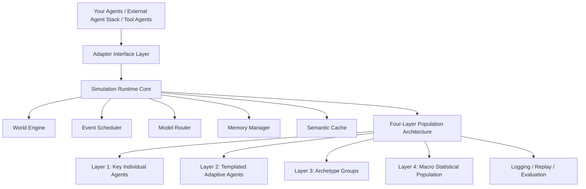
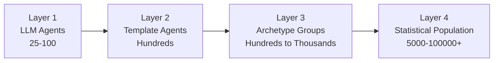
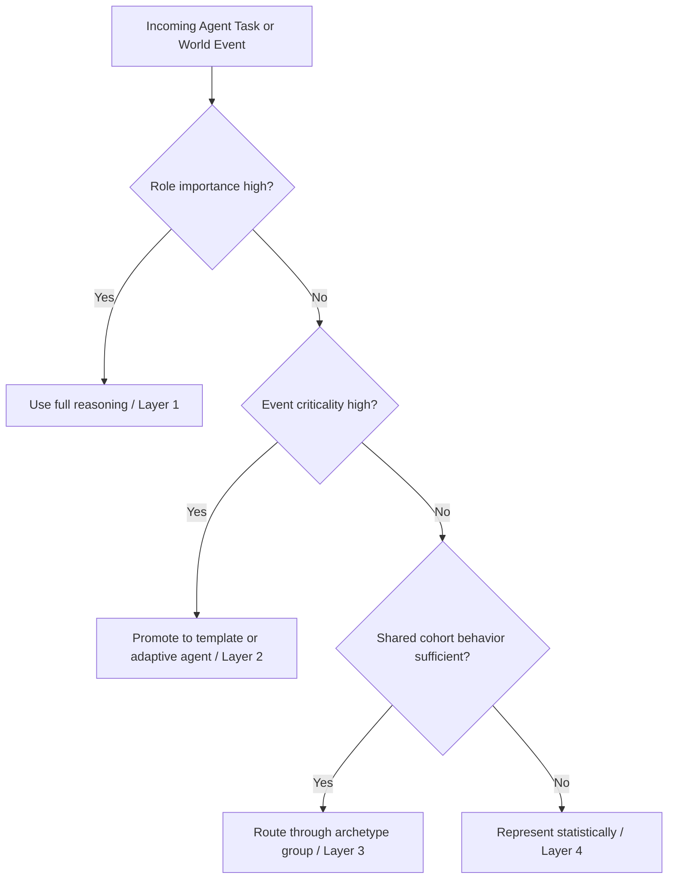

<div align="center">

# Universal Multi-Agent Simulation Engine

[English](README.md) | [繁體中文](README.zh-TW.md)

**一個可擴展的大規模多 Agent 模擬架構：不把所有實體都塞進同一套高成本 cognition stack，而是把智慧配置到真正會影響結果的地方。**


</div>

---

## Overview

Universal Multi-Agent Simulation Engine 是一套開放式架構，適合用來建立合成社會、經濟系統、遊戲世界與政策模擬，而不需要為每一個實體都支付完整深度推理的成本。

它的核心主張很簡單：模擬品質不取決於是否把智慧最大化地灌到每個地方，而在於是否把智慧分配到真正會改變結果的位置。

這代表關鍵 agents 可以使用深度推理，重複性角色可以用模板執行，代表性群體可以從 archetypes 擴散，而長尾人口則可以維持統計表示，同時不破壞整體世界的一致性。

---

## What makes this different

- 不是每個實體都需要同一套 cognition stack。
- Fidelity 應該被配置，而不是被預設成固定成本。
- 規模成長時應該平滑退化，而不是昂貴崩潰。
- 領域知識應該存在於 world configuration，而不是硬編碼在 agent logic 裡。
- Runtime 應該能整合你既有的 agents，而不是強迫你重寫成封閉框架。

---

## Architecture Snapshot

### Public Architecture Diagram


`assets/architecture-overview-v2.png` 是這個 repository 對外展示的主架構圖，用來呈現從外部 agents 與 adapters，到 runtime orchestration 與 four-layer population model 的整體結構。

如果想看更細的系統視角，請參考 `assets/architecture-detail-v2.png`。

### Reference Runtime Flow



### Demo and Screenshots


<p align="center">
  
  
  
</p>

`assets/` 目錄是預留給公開展示用的圖、GIF 與截圖。現在 repo 已經把結構整理好，之後可以直接替換成正式視覺素材。

---

## Three design principles

### 1. Behavior and domain should be separated
Agent loop 本身應該保持通用：perceive、reason、act、update memory。領域規則應該放在 world configuration、scenario policies 與 environment constraints 中，而不是硬寫進 cognitive core。

### 2. Cost and quality should be tunable
同一個概念上的 agent，應該可以依角色重要性、事件關鍵程度、預期下游影響與預算，在不同 fidelity 等級之間切換。

在實務上，runtime 可以在以下模式之間調整：
- full LLM agents
- template-driven agents
- archetype-based diffusion
- statistical approximations

### 3. Scale should be adaptive
一個 25 agents 的模擬，和一個 100,000 agents 的模擬，不應該需要兩套完全不同的架構思想。Engine 應該自動選擇合適的 execution strategy，而不是逼所有情況都走同一條昂貴路徑。

---

## Four-layer population model

| Layer | Mode | Typical scale | Use when |
|---|---|---:|---|
| 1 | LLM agents | 25-100 | 關鍵個體、領導角色、少數高風險決策 |
| 2 | Template agents | hundreds | 需要一致性，但不需要每一步都深度推理的重複性角色 |
| 3 | Archetype groups | hundreds to thousands | 具有共享行為模式的代表性群體 |
| 4 | Statistical population | 5,000-100,000+ | 背景人口、總量壓力、宏觀動態 |

這個分層設計把昂貴的 cognition 集中在真正重要的地方，同時保留大規模模擬所需的結構真實感。



---

## Scale strategy

Runtime 應該依據以下條件決定工作怎麼路由：
- role importance
- event criticality
- expected downstream impact
- budget constraints

少數關鍵 agents 值得使用完整推理。重複性角色可以交給模板。大型相似群體可以從 archetypes 擴散。龐大的背景人口則可以用統計方式表示。

這不是弱系統的退而求其次，而是面向真實大規模模擬的預設 operating model。



---

## Why this repository exists

大多數 multi-agent demo 在小規模時看起來很驚豔，但當實體數量一變大，就會變得昂貴、僵硬，或難以解讀。

這個 repository 聚焦在一個更務實的目標：在真正重要的地方保留 realism，同時透過 selective intelligence allocation 把系統擴展到更大的群體規模。

這代表：

- 關鍵 agents 使用高 fidelity 推理
- 重複性角色使用輕量模板
- 代表性群體使用 archetype diffusion
- 長尾人口使用 macro statistical simulation
- 透過 memory compression 與 semantic reuse 降低浪費

---

## Core Concepts

### 1. Layered population architecture
不是每個實體都應該用同樣深度的推理來建模。系統把人口分成四個 layer，讓 fidelity 可以集中到最有影響力的位置。

### 2. Cost-aware routing
Runtime 應該根據重要性、事件關鍵程度、預期下游影響與預算，決定什麼時候值得支付完整推理成本。

### 3. Hierarchical memory
長時間運行的模擬不能只靠原始 transcript。Working memory、episodic summaries、compressed long-term state 與 semantic reuse，能讓模擬更穩定，也更便宜。

### 4. Adapter-first integration
Runtime boundary 不應該在乎 agent 來自 AgentScope、LangGraph、AutoGen、CrewAI、自訂 Python class，還是內部平台。這個 framework 標準化的是 simulation boundary，讓你能接入自己的 agents、tools、models 與 memory backends，而不用整套重蓋。

---

## Features

- Four-layer population model，可超越小型 demo 規模
- Selective intelligence allocation，而不是統一支付 cognition 成本
- Adapter interfaces，可整合自訂 agents 與 orchestration stacks
- Model routing，用於 fidelity-aware reasoning allocation
- Hierarchical memory 與 semantic cache patterns
- 便於 benchmark 與實驗的研究友善結構
- 適用於 social、economic、strategic 與 game simulations 的 domain-agnostic 設計

---

## Use Cases

- 合成社會與制度行為模擬
- 宏觀與微觀市場模擬
- 遊戲世界與可擴展 NPC 生態
- 政策、傳染與介入建模
- Agent infrastructure research 與 benchmarking

---

## Repository Structure

```text
assets/      公開圖像、GIF、截圖與品牌素材
examples/    最小模擬與 adapter 範例
src/         framework skeleton 與核心抽象
docs/        whitepaper、架構說明與整合指南
```

### Key files

- `docs/whitepaper.md` - 完整論述與架構動機
- `docs/framework-overview.md` - 精簡版框架總覽
- `docs/integration-guide.md` - 如何接入你自己的 agents
- `src/universal_multi_agent_sim/` - 起始套件結構
- `examples/minimal_simulation.py` - 小型端到端範例

---

## Minimal Adapter Interface

```python
class AgentAdapter:
    def act(self, observation: dict, context: dict) -> dict:
        raise NotImplementedError

    def update_memory(self, event: dict) -> None:
        raise NotImplementedError

    def importance_score(self) -> float:
        raise NotImplementedError
```

---

## Implementation Roadmap

- [x] 發佈架構文件與公開 repository 結構
- [x] 補上 starter `assets/`、`src/` 與 `examples/` 目錄
- [ ] 補上最終公開版圖像與真實產品截圖
- [ ] 補上 fidelity 與 cost 的 benchmark tables
- [ ] 補上 replay、evaluation 與 observability 範例
- [ ] 補上外部 agent stacks 的 reference adapters

---

## Quick Start

```bash
git clone https://github.com/ab410010066-byte/universal-multi-agent-simulation-engine.git
cd universal-multi-agent-simulation-engine
python -m venv .venv
source .venv/bin/activate
python examples/minimal_simulation.py
```

---

## Documentation

- Framework overview: `docs/framework-overview.md`
- Whitepaper: `docs/whitepaper.md`
- Integration guide: `docs/integration-guide.md`

---

## License

MIT
